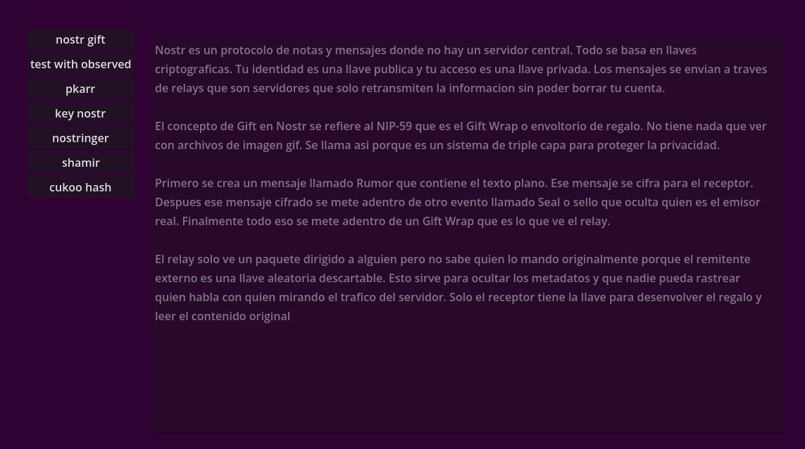

# Gtool GDextension / Extensión GD de Gtool

> ES: Extensión para Godot que añade soporte P2P (BitTorrent), DNS descentralizado, criptografía e Inteligencia Artificial nativa (xLSTM) con capacidades de inferencia y entrenamiento.  
> EN: GDextension for Godot adding P2P support (BitTorrent), decentralized DNS, cryptography, and native AI (xLSTM) with inference and training capabilities.

---

## Descripción / Description

- **ES:** Gtool es una extensión modular para Godot que integra funciones de red descentralizada y seguridad.  
- **EN:** Gtool is a modular extension for Godot that integrates decentralized networking and security.

- **ES:** Incluye clientes Nostrn (simple y con observadores), resolución DNS distribuida, soporte para BitTorrent y un motor de IA (xLSTM) con soporte completo para entrenamiento.  
- **EN:** Includes Nostrn clients (simple and observer), distributed DNS resolution, BitTorrent support, and an AI engine (xLSTM) with full training support.

---

## Características principales / Key features

- **ES:** Cliente BitTorrent: soporte para Magnet links, trackers UDP/HTTP y descubrimiento de peers asíncrono.  
- **EN:** BitTorrent Client: support for Magnet links, UDP/HTTP trackers, and asynchronous peer discovery.

- **ES:** PKARR DNS: resolución y publicación de registros descentralizados.  
- **EN:** PKARR DNS: decentralized resolution and record publishing.

- **ES:** Nostrn:  
  - Cliente simple para mensajería directa.  
  - Cliente con observadores para monitoreo y difusión.  
- **EN:** Nostrn:  
  - Simple client for direct messaging.  
  - Observer client for monitoring and broadcasting.

- **ES:** Soporte NIP:  
  - NIP-44: mensajes directos.  
  - NIP-59: mensajes cifrados.  
  - NIP-17: mensajes cifrados en grupos.  
- **EN:** NIP support:  
  - NIP-44: direct messages.  
  - NIP-59: encrypted messages.  
  - NIP-17: group encrypted messages.

- **ES:** Generación de claves compartidas para Nostrn y PKARR.  
- **EN:** Shared key generation for Nostrn and PKARR.

- **ES:** Cifrado en anillo para privacidad de remitente.  
- **EN:** Ring encryption for sender privacy.

- **ES:** Shamir Secret Sharing: divide secretos o hashes en múltiples partes, ideal para distribuir seguridad.  
- **EN:** Shamir Secret Sharing: split secrets or hashes into multiple parts, ideal for distributed security.

- **ES:** Cuckoo Filter: almacenamiento de hashes ultra eficiente, reduce el tamaño y permite verificar pertenencia de mensajes o partes de archivos.  
- **EN:** Cuckoo Filter: ultra-efficient hash storage, reduces size and allows checking membership of messages or file parts.

- **ES:** IA Nativa (xLSTM): Soporte para modelos de lenguaje xLSTM, permitiendo inferencia, gestión de estado de entrenamiento y tokenización profesional desde el primer día.  
- **EN:** Native AI (xLSTM): Support for xLSTM language models, allowing inference, training state management, and professional tokenization from day zero.

---

## Capturas de pantalla / Screenshots

### Main Wiki / Vista Principal

- **ES:** Vista principal con una descripción detallada de cada componente, similar a una mini wiki.
- **EN:** Main view with a detailed description of each component, acting as a mini wiki.

### Nostr Chat / Chat de Nostr

- **ES:** Interfaz para mensajería y chat mediante el protocolo Nostr.
- **EN:** Interface for messaging and chat using the Nostr protocol.

### Observer Mode / Modo Observador

- **ES:** Vista del modo observador para monitoreo y difusión.
- **EN:** Observer mode view for monitoring and broadcasting.

### Relay Management / Gestión de Relays

- **ES:** Sistema de carga y descarga de direcciones de relays Nostr.
- **EN:** System for loading and saving Nostr relay addresses.

---

## Ejemplos de uso / Usage Examples

### Cuckoo Filter
```gdscript
var cuckoo = CuckooFilterGodot.new()
cuckoo.init_filter(10000, 16) # Capacidad 10k, huella 16 bits

# Generar y añadir hash / Generate and add hash
var data = "mensaje_secreto".to_utf8_buffer()
var h = cuckoo.generate_hash(data)
cuckoo.add(h)

# Verificar persistencia / Verify persistence
cuckoo.save_to_file("user://filtros.bin")
```

### Ring Signature (Privacidad de remitente / Sender privacy)
```gdscript
var nostringer = Nostringer.new()
var message = "voto_secreto".to_utf8_buffer()

# Crear un grupo de claves públicas (el anillo) / Create a group of public keys (the ring)
var ring = [
	"pubkey_1_hex",
	"pubkey_2_hex",
    "mi_propia_pubkey_hex"
]

# Firmar de forma anónima dentro del anillo / Sign anonymously within the ring
# Variante "blsag" permite detectar doble firma sin revelar quién fue
var result = nostringer.sign(message, "mi_clave_privada_hex", ring, "blsag")
var sig = result["signature"]

# Verificar / Verify
var verification = nostringer.verify(sig, message, ring)
if verification["valid"]:
	print("Firma válida y anónima. Key Image: ", verification["key_image"])
```

### Shamir Secret Sharing
```gdscript
var shamir = Shamir.new()
var secret = "mi_clave_secreta".to_utf8_buffer()

# Crear 5 trozos, se necesitan 3 para recuperar / Create 5 shares, 3 needed to recover
var shares = shamir.create_shares(secret, 5, 3)

# Combinar trozos para recuperar / Combine shares to recover
var recovered = shamir.combine_shares([shares[0], shares[2], shares[4]])
print(recovered.get_string_from_utf8())
```

### IA Nativa (xLSTM)
```gdscript
var ai = XLSTMLargeChat.new()

# Inicializar sesión (entrena tokenizador si no existe)
# Initialize session (trains tokenizer if it doesn't exist)
ai.init_session("datos_entrenamiento.txt")

# Entrenar el modelo con un archivo de texto / Train model with a text file
ai.train_on_file("conocimiento.txt")

# Generar texto basado en un seed / Generate text based on a seed
var response = ai.generate("El futuro de Gtool es", 50)
print("IA: ", response)

# Guardar estado del modelo / Save model state
ai.save_model("mi_modelo_ia.mpk")
```

### BitTorrent & Magnet Links
```gdscript
var torrent = InfoTorrent.new()

# Cargar desde Magnet URI / Load from Magnet URI
if torrent.load_from_magnet("magnet:?xt=urn:btih:01c13728..."):
	# Añadir trackers personalizados / Add custom trackers
	torrent.add_tracker("udp://tracker.opentrackr.org:1337/announce")
	
	# Iniciar búsqueda de metadatos en segundo plano (Asíncrono)
	# Start background metadata fetching (Asynchronous)
	torrent.fetch_metadata()

func _process(_delta):
	# Revisar si la metadata terminó de cargar / Check if metadata finished loading
	if torrent.poll_metadata():
		print("Torrent listo: ", torrent.get_display_name())
		print("Archivos: ", torrent.get_files())
	
	# Consultar peers descubiertos sin bloquear el juego
	# Query discovered peers without blocking the game
	var peers = torrent.get_peers()
	if peers.size() > 0 and peers[0] != "await":
		print("Peers activos: ", peers)
```

---

## Compatibilidad / Compatibility

- **ES:** Godot 4.6+ en Windows, Linux, macOS y Android (ARM64-v8a).  
- **EN:** Godot 4.6+ on Windows, Linux, macOS, and Android (ARM64-v8a).

---

## Roadmap / Hoja de ruta

- **ES:** Próximas versiones incluirán ejemplos multijugador y soporte NAT traversal.  
- **EN:** Upcoming versions will include multiplayer examples and NAT traversal support.

---

## Licencia / License

- **ES:** MIT. Ver archivo `LICENSE`.  
- **EN:** MIT. See `LICENSE` file.

---

## Contribuciones / Contributions

- **ES:** Se aceptan issues y pull requests con documentación bilingüe y pruebas reproducibles.  
- **EN:** Issues and pull requests with bilingual documentation and reproducible tests are welcome.
